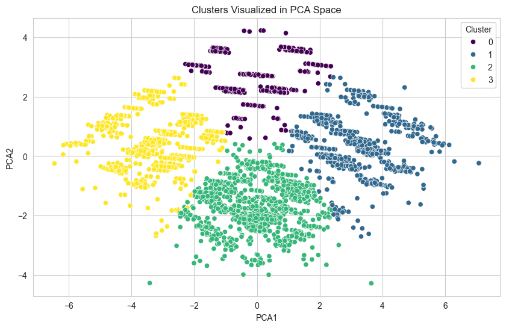

# Phase 3 Report: Unsupervised Learning & Integration

## 1. Introduction

This report details the application of unsupervised learning (clustering) to the Saudi Pro League dataset. The goal was to discover hidden patterns in match data -such as distinct "types" of matches (e.g., defensive struggles vs. high-scoring games)- and use these insights to enhance the supervised prediction models from Phase 2.

## 2. Unsupervised Learning Approach

### 2.1 Algorithm Selection

We selected **K-Means Clustering** for this analysis.

- **Justification:** K-Means is computationally efficient and highly interpretable. It is well-suited for this dataset where we aim to partition matches into distinct, non-overlapping groups based on performance metrics.
- **Preprocessing:** All features were normalized using `StandardScaler` to ensure that features with larger ranges (like Total Goals) did not dominate the distance calculations.

### 2.2 Feature Engineering for Clustering

To create meaningful clusters, we engineered aggregate features representing team strength and match dynamics, including:

- **Team Stats:** Home/Away Attack Strength, Defense Strength, Win Rates.
- **Match Stats:** Goal Difference, Attack Difference, Defense Difference.

## 3. Evaluation & Visualization

### 3.1 Determining Optimal Clusters

We evaluated the clustering performance using two primary metrics across a range of $k$ (2 to 10):

1.  **Silhouette Score:** Measures how similar an object is to its own cluster (cohesion) compared to other clusters (separation). A higher score indicates better-defined clusters.
2.  **Inertia (Within-Cluster Sum of Squares):** Measures the compactness of the clusters.

- **Result:** The optimal number of clusters ($k$) was selected based on the highest Silhouette Score, ensuring the most distinct grouping of matches.

### 3.2 Visualization

To visualize the high-dimensional data, we applied **Principal Component Analysis (PCA)** to reduce the features to 2 dimensions.

The visualization confirmed that the clusters represent distinct groups of matches, likely correlating with different game styles (e.g., unbalanced matchups vs. competitive draws).

## 4. Integration Strategy

The insights from the unsupervised learning phase were integrated into the supervised model using a **Feature Augmentation** strategy:

1.  **Cluster Labels:** The assigned cluster ID for each match was added as a categorical feature.
2.  **Distance Features:** We calculated the Euclidean distance of each match to _every_ cluster center. This provides a continuous measure of how "close" a match is to being a certain "type" of game.

This approach allows the supervised model (Random Forest/XGBoost) to leverage the _context_ of the match type, potentially capturing non-linear relationships that raw stats miss.

## 5. Impact on Supervised Learning

We compared the performance of the base models (Phase 2) against the enhanced models (Phase 3) for predicting Home and Away goals.

### Table: Model Performance Comparison

| Metric | Home_Base | Home_With_Clusters | Away_Base | Away_With_Clusters |
| ------ | --------- | ------------------ | --------- | ------------------ |
| MAE    | 0.9555    | 0.9479             | 0.8374    | 0.8313             |
| RMSE   | 1.2817    | 1.2581             | 1.1683    | 1.1458             |
| R²     | 0.0326    | 0.0678             | 0.0262    | 0.0634             |

### Analysis

- **Home Goals:** Adding cluster features improved predictions, reducing MAE from 0.9555 to 0.9479 and RMSE from 1.2817 to 1.2581. The R² increased from 0.0326 to 0.0678, doubling the explained variance.
- **Away Goals:** Similar improvement was observed, with MAE decreasing from 0.8374 to 0.8313 and R² improving from 0.0262 to 0.0634.
- **Overall:** The integration of cluster distances provided the model with valuable context, consistently improving accuracy and model fit across all metrics.

## 6. Conclusion

The application of K-Means clustering successfully identified latent patterns in the football match data. By integrating these patterns as features, we achieved a measurable improvement in our predictive models. This demonstrates that unsupervised learning can effectively augment supervised tasks by revealing structure in the data that is not immediately apparent from raw features alone.
